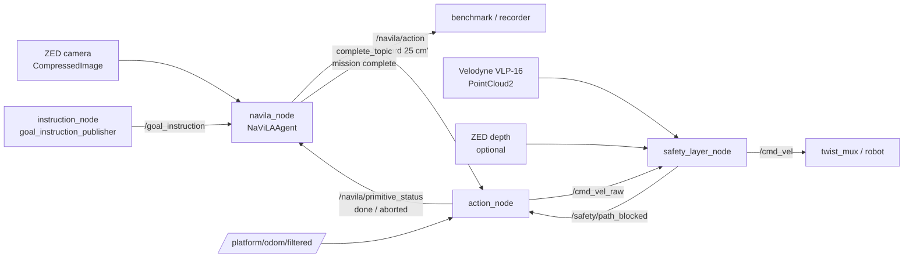

# navila_ros2_bridge

A **ROS 2 (Humble)** bridge that deploys the [NaVILA](https://github.com/AnjieCheng/NaVILA) Vision-Language-Action (VLA) model on a **Clearpath Husky**. The package takes a natural-language instruction (e.g. *"go to the kitchen"*), queries NaVILA over a rolling window of camera observations, and executes the model's decisions as **closed-loop motion primitives** on odometry, with an optional predictive anti-collision safety layer.

The implementation aims for **maximum fidelity** to the official [`AnjieCheng/NaVILA`](https://github.com/AnjieCheng/NaVILA) inference, adapted for a real robot (continuous control, waiting for physical completion of each primitive, obstacle handling). Inference runs on an external GPU workstation; only `/cmd_vel` reaches the robot.

---

## Table of Contents

- [Overview](#overview)
- [Architecture](#architecture)
- [Nodes](#nodes)
- [Model](#model)
- [Requirements](#requirements)
- [Installation](#installation)
- [Model Weights](#model-weights)
- [Build](#build)
- [Usage](#usage)
- [Topics](#topics)
- [Configuration](#configuration)
- [How It Works](#how-it-works)
- [Goal Rewriting (Ollama)](#goal-rewriting-ollama)
- [Safety Layer](#safety-layer)
- [Fidelity to the Official Repo](#fidelity-to-the-official-repo)
- [Repository Layout](#repository-layout)
- [Known Issues / Notes](#known-issues--notes)
- [Troubleshooting](#troubleshooting)
- [Citation](#citation)
- [Acknowledgments](#acknowledgments)
- [License](#license)

---

## Overview

The stack splits responsibilities across four nodes so that perception, decision-making, motion execution and collision safety stay decoupled and independently testable:

- **`navila_node`** — pure ROS plumbing around a ROS-agnostic `NaViLAAgent`: decodes frames, handles timing/threading, and drives an event-driven, step-synchronous inference loop.
- **`action_node`** — executes each primitive (`forward N cm`, `turn_left/right N deg`) as a closed-loop motion on odometry.
- **`safety_layer_node`** — a velocity guard that brakes/aborts on predicted collisions using the Velodyne point cloud (optional, off by default).
- **`instruction_node`** (`goal_instruction_publisher`) — a terminal tool to send goals by hand, optionally rewriting them through a local Ollama LLM.

Design highlights:

- **Event-driven, step-synchronous loop** — one decision → one primitive → observe → next decision. The observation history advances by exactly one frame per completed primitive, held inside the agent. This replicates NaVILA's online evaluation.
- **Text-to-primitive parsing** — the model emits free text; the agent parses it, quantizes the magnitude (forward in multiples of 25 cm, turns in multiples of 15°) and expands it into a queue of unit primitives that are *replayed without re-running inference* until drained (official `queue_actions` behaviour).
- **Closed-loop execution** — each primitive waits for physical completion on odometry (with a failsafe deadline), instead of the simulator's instantaneous step.
- **Predictive safety by re-planning** — the safety layer aborts a forward primitive on a predicted collision so the agent re-observes and re-plans; it never steers.

---

## Architecture



The loop is **synchronized with motion**, not a fixed-rate controller. With `safety:=false` (default), `action_node` publishes directly to `/cmd_vel` and `safety_layer_node` is not started.

---

## Nodes

### `navila_node`
The core node (internal class `NaViLANode`; the launch file names the ROS node `navila_node`, which is the key the YAML parameters bind to).

- Loads the model in a **background thread**, so ROS spin is never blocked.
- Waits for the first camera frame **and** a goal before starting the loop.
- On each `done`/`aborted` (or a new goal), `_kick_drive` launches `_drive_thread`, which waits for a fresh frame (`_wait_fresh_frame`), decodes it, converts BGR→RGB and calls `agent.step(rgb, prev_status)`.
- Publishes one primitive per handshake; on `stop` it disarms and publishes the completion signal.
- Colour handling: `_decode_frame` only decodes `CompressedImage → BGR` (no conversion). `_to_rgb` feeds the agent (model expects RGB), `_to_bgr` feeds the debug writer; both honour `is_frame_rgb`.
- Frame-freshness gate uses `time.monotonic()` + a local frame counter (never `header.stamp`), robust to the dual-machine ZED/inference setup where clocks may differ.

### `action_node`
Translates primitives into `geometry_msgs/Twist` and executes each motion closed-loop on odometry.

- Parses commands `"<action> <value> <unit>"`: `forward N cm`, `turn_left N deg`, `turn_right N deg`, `stop`. Unknown actions → `done`.
- Saves the start pose from odometry, measures actual progress (Euclidean distance for forward, normalized Δyaw for turns) and stops at target with a small anti-overshoot margin.
- Acceleration-ramp smoothing on linear/angular velocity.
- Failsafe: if the target is not reached within a deadline (≈ 3× nominal time + 1 s), the primitive is `aborted`.
- On `/safety/path_blocked=True` it aborts the current **forward** primitive immediately.
- Publishes `/navila/primitive_status` with `done` (reached by measurement) or `aborted` (failsafe / blocked).

### `safety_layer_node`
Predictive anti-collision velocity filter `/cmd_vel_raw → /cmd_vel`. Optional (started only with `safety:=true`).

- Front-end: **VLP-16 PointCloud2 → `base_link` (TF) → height-band ground removal → 2D occupancy grid**.
- Derives per-sector minimum distances (front/left/right/rear) **and** runs a predictive footprint sweep on the commanded `(v, w)` trajectory (forward-simulated unicycle) to catch collisions the static cones miss (e.g. a corner swinging in during a turn).
- Hard front stop + progressive slowdown between `front_slow_dist` and `front_stop_dist`; rear protection while reversing; turn reduction near a side wall; rotation-would-hit stop.
- Optional fusion with the ZED depth (2nd-percentile front distance) for low obstacles.
- Fail-safe on cloud/command timeout; latches `/safety/path_blocked` after `block_debounce` consecutive blocked cycles.

### `instruction_node`
Reads goals from stdin, optionally rewrites them via a local Ollama LLM, publishes on `/goal_instruction`.

---

## Model

- **Checkpoint:** `a8cheng/navila-llama3-8b-8f` (downloaded automatically from Hugging Face on first launch if `model_path` has no `config.json`).
- **Backbone:** SigLIP-class vision encoder + LLaMA3-8B (VILA family).
- **Input:** `num_video_frames` frames (default 8: 7 historical + 1 current); the checkpoint config is authoritative and may override this at load time.
- **Output:** free-form text containing the action and magnitude, e.g. *"the next action is to move forward 75 cm"* or *"turn left 30 degrees"*, parsed by regex into `(action, value, unit)`.

The model is inference-ready — **no training required**. `deepspeed` is mocked at import time so the LLaVA/VILA stack loads without it.

---

## Requirements

**Software**
- ROS 2 Humble, Python 3.10
- A CUDA GPU able to run an 8B VLA, with the NaVILA/VILA (LLaVA) stack installed
  - x86: standard torch / flash-attn wheels
  - Jetson AGX Orin: torch / flash-attn wheels from the Jetson AI Lab index
- Cyclone DDS (recommended RMW)
- Ollama (optional, only for `instruction_node` goal rewriting)

**Hardware (reference platform)**
- Clearpath Husky
- ZED stereo camera (RGB + optional depth)
- Velodyne VLP-16 LiDAR
- External GPU workstation for inference (only `/cmd_vel` goes to the robot)

---

## Installation

```bash
cd ~/ros_ws/src
git clone <repo-url> navila_ros2_bridge
cd ~/ros_ws
colcon build --packages-select navila_ros2_bridge
source install/setup.bash
```

The NaVILA source is expected under `navila_ros2_bridge/third_party/NaVILA/` (the agent inserts it into `sys.path`; override with the `NAVILA_REPO` environment variable).

---

## Model Weights

Downloaded automatically on first launch (`NaViLAAgent.load_model`) if `model_path` has no `config.json`. To pre-fetch manually:

```bash
huggingface-cli download a8cheng/navila-llama3-8b-8f --local-dir /models
```

Relevant environment variables:

```bash
export NAVILA_MODEL_PATH=/models              # default model_path
export NAVILA_REPO=/path/to/NaVILA            # optional: vendored model source
```

---

## Build

```bash
cd ~/ros_ws
colcon build --packages-select navila_ros2_bridge
source install/setup.bash
```

---

## Usage

### 1. Launch the stack

Simulation profile (`sim_navila_config.yaml`, `use_sim_time: true`):

```bash
ros2 launch navila_ros2_bridge sim_navila.launch.py safety:=true
```

Real-robot profile (`lab_navila_config.yaml`, `use_sim_time: false`):

```bash
ros2 launch navila_ros2_bridge lab_navila.launch.py safety:=true
```

Launch argument:

| Arg | Default | Effect |
| --- | --- | --- |
| `safety` | `false` | `true` → start `safety_layer_node`; `action_node` → `/cmd_vel_raw` → safety → `/cmd_vel`. `false` → `action_node` → `/cmd_vel` directly. |

Both launch files include `husky_navigation`'s `pointcloud_to_laserscan.launch.py`, start `instruction_node` in an `xterm`, and delay `navila_node` by 2 s (`TimerAction`). Wait for the `NaVILA ready` / `Goal received` logs before expecting motion.

### 2. Send a goal

Terminal publisher (started by the launch file, or run standalone):

```bash
ros2 run navila_ros2_bridge instruction_node
Goal > go down the corridor and stop at the second door on the right
```

or publish directly (use `--once`: every goal message resets the history and re-arms the loop):

```bash
ros2 topic pub --once /goal_instruction std_msgs/String "{data: 'go to the kitchen'}"
```

### 3. Reset the loop / history

```bash
ros2 topic pub --once /navila/reset std_msgs/Empty "{}"
```

### 4. Monitoring

```bash
ros2 topic echo /navila/action           --qos-reliability reliable
ros2 topic echo /navila/primitive_status --qos-reliability reliable
```

Annotated debug frames (action label, chunk, instruction, direction arrow) are written to `debug_dir` (default `/home/ros_ws/tmp/navila_debug/run_<timestamp>/`), useful to verify what the model sees and decides.

Expected log pattern:

```
NaViLA raw: '...move forward 75 cm'
[inference] cmd='forward 25 cm' ×3 (coda:2, hist:N)
[queue] cmd='forward 25 cm' ×0 (coda:1, hist:N)
[queue] cmd='forward 25 cm' ×0 (coda:0, hist:N)
```

---

## Topics

### `navila_node`
| Direction | Parameter (default) | Type |
| --- | --- | --- |
| sub | `image_topic` (sim `/sensors/front_camera/color/image_raw/compressed`, lab `/zed/rgb/color/rect/image/compressed`) | `sensor_msgs/CompressedImage` |
| sub | `goal_topic` (`/goal_instruction`) | `std_msgs/String` |
| sub | `reset_topic` (`/navila/reset`) | `std_msgs/Empty` |
| sub | `status_topic` (`/navila/primitive_status`) | `std_msgs/String` |
| pub | `action_topic` (`/navila/action`) | `std_msgs/String` |
| pub | `complete_topic` (default `/navila/complete`; profiles → `/benchmark/command`) | `std_msgs/String` — payload `"stop"` |

> **Note (code vs docstring):** the docstring advertises `complete` as `std_msgs/Bool True`, but the implementation publishes a `std_msgs/String` `"stop"`. Both profiles remap `complete_topic` to **`/benchmark/command`** to drive the episode recorder. Align the docstring/subscribers with the `String` contract (or switch to `Bool`).

QoS: `image_topic` is `BEST_EFFORT / KEEP_LAST(1)`.

### `action_node`
| Direction | Parameter (default) | Type |
| --- | --- | --- |
| sub | `action_topic` (`/navila/action`) | `std_msgs/String` |
| sub | `odom_topic` (`/platform/odom/filtered`) | `nav_msgs/Odometry` (BEST_EFFORT) |
| sub | `path_blocked_topic` (`/safety/path_blocked`) | `std_msgs/Bool` |
| pub | `cmd_vel_topic` (`/cmd_vel_raw` or `/cmd_vel`, set by launch) | `geometry_msgs/Twist` |
| pub | `status_topic` (`/navila/primitive_status`) | `std_msgs/String` |

### `safety_layer_node`
| Direction | Parameter (default) | Type |
| --- | --- | --- |
| sub | `cmd_in_topic` (`/cmd_vel_raw`) | `geometry_msgs/Twist` |
| sub | `cloud_topic` (`/velodyne_points`) | `sensor_msgs/PointCloud2` |
| sub | `depth_topic` (`/zed/depth/depth_registered`, if `enable_depth`) | `sensor_msgs/Image` |
| pub | `cmd_out_topic` (`/cmd_vel`) | `geometry_msgs/Twist` |
| pub | `path_blocked_topic` (`/safety/path_blocked`) | `std_msgs/Bool` |
| pub | `occupancy_topic` (`/safety/occupancy`, if `publish_grid`) | `nav_msgs/OccupancyGrid` |

### `instruction_node`
| Direction | Topic | Type |
| --- | --- | --- |
| pub | `/goal_instruction` | `std_msgs/String` |

---

## Configuration

Parameters are provided via YAML profiles, one section per node (top-level key = **node name**). Two profiles ship:

- `config/sim_navila_config.yaml` — simulation (`use_sim_time: true`).
- `config/lab_navila_config.yaml` — real robot (`use_sim_time: false`), tuned for a confined Vicon lab (tighter safety distances, lower speeds, larger footprint margin around people).

Key parameters:

| Node | Parameter | sim / lab | Meaning |
| --- | --- | --- | --- |
| `navila_node` | `model_path` | `/models` | checkpoint dir |
| `navila_node` | `num_video_frames` | `8` | frames per inference (7 hist + 1 curr); checkpoint may override |
| `navila_node` | `max_history_frames` | `512` | max agent history depth |
| `navila_node` | `is_frame_rgb` | `false` | `false` = decoded frame is BGR, node converts BGR→RGB before the model |
| `navila_node` | `frame_wait_timeout_sec` | `1.0` / `1.5` | max wait for a fresh frame after a primitive |
| `navila_node` | `frame_settle_sec` | `0.0` / `0.3` | settling margin before sampling the frame (real inertia) |
| `action_node` | `linear_x` / `angular_z` | `0.4,0.30` / `0.35,0.30` | forward / in-place-turn velocities |
| `action_node` | `max_acc_linear` / `max_acc_angular` | `0.5,1.0` / `0.4,0.8` | acceleration-ramp limits (gentler on real HW) |
| `safety_layer_node` | `cloud_topic` | `/velodyne_points` | **PointCloud2** input |
| `safety_layer_node` | `base_frame` | `base_link` | TF target for the cloud |
| `safety_layer_node` | `front_stop_dist` / `front_slow_dist` | `1.2/1.5` (sim), `1.0/1.3` (lab) | **must satisfy `stop < slow`** |
| `safety_layer_node` | `enable_depth` | `false` | ZED depth fusion (enable only after verifying `depth_topic`) |
| `safety_layer_node` | `robot_half_length` / `robot_half_width` | `0.50` / `0.34` | Husky footprint |

> `path_blocked_topic` **must** be identical in `action_node` and `safety_layer_node`. `cmd_vel_topic` is injected by the launch file based on `safety` and must not be set in YAML. Undeclared parameters are silently ignored.

**Verify before the first real run** (from `lab_navila_config.yaml`): exact ZED `image_topic`, that filtered `odom_topic` is actually published, static TF `base_link → velodyne` for `cloud_topic`, `is_frame_rgb` on the debug frames, and `depth_topic` if enabling depth.

---

## How It Works

**Event-driven, step-synchronous loop.** `_kick_drive` fires a `_drive_thread` on each new goal, each `done`/`aborted` status, and periodically (0.5 s timer, as a fallback kick). Only one cycle runs at a time (`_cycle_active`), which stays latched after publishing an action and is cleared by the next status callback — so the cadence is set by real motion, not a fixed rate.

**Agent step (`NaViLAAgent.step`).**
1. Reconcile the previous primitive: on `aborted`, drop the pending decision frame and clear the queue (the motion did not happen); on `done`, promote the pending frame into the history.
2. If the primitive queue is non-empty, **replay** the next queued primitive without inference.
3. Otherwise run inference over `num_video_frames` sampled frames (`_sample_history`: front-pad with black frames, sample `n−1` evenly with `endpoint=False`, append the latest), parse the output, and **expand** the magnitude into unit primitives — e.g. `forward 75 cm → 3 × "forward 25 cm"`, `turn_left 30° → 2 × "turn_left 15 deg"` — publishing the first and queuing the rest.

**Prompt.** The `llama_3` conversation template with `num_video_frames − 1` historical `<image>` tokens plus one current `<image>`, the task string, and a fixed instruction asking for the next action (turn by degrees / move forward by distance / stop). Generation is greedy (`do_sample=False`, `num_beams=1`, `max_new_tokens=32`).

**Parsing.** Regex patterns match `stop` / `is move forward` / `is turn left` / `is turn right`; magnitudes are quantized (forward → nearest of 25/50/75 cm, turn → nearest of 15/30/45°). No match defaults to `stop`.

**Frame freshness.** After a primitive completes, `_wait_fresh_frame` blocks until a frame arrives with `seq > after_seq` and past the settle window, using `monotonic()` and a local counter only — safe across unsynchronized machine clocks.

---

## Goal Rewriting (Ollama)

`instruction_node` (`goal_instruction_publisher`) can rewrite raw goals into clean, egocentric, imperative English instructions suited to a VLN-trained VLA, using a **local Ollama** server. It falls back to the raw goal on any failure, so Ollama is optional.

```bash
curl -fsSL https://ollama.com/install.sh | sh
ollama serve
ollama pull gemma3:12b      # default model
```

| Parameter | Default | Meaning |
| --- | --- | --- |
| `use_llm` | `true` | set `false` to publish raw goals verbatim |
| `model` | `gemma3:12b` | Ollama model tag |
| `ollama_url` | `http://localhost:11434` | Ollama endpoint |
| `timeout` | `15.0` | request timeout (s) |
| `require_confirmation` | `false` | prompt `[Y/n/e(dit)]` before publishing a rewrite |

```bash
ros2 run navila_ros2_bridge instruction_node --ros-args -p ollama_url:=http://192.168.x.x:11434
ros2 run navila_ros2_bridge instruction_node --ros-args -p use_llm:=false
```

---

## Safety Layer

A pure velocity guard — it can brake/abort but never steers, so it does not contaminate the VLA's navigation behaviour.

Pipeline: **PointCloud2 → `base_link` (TF) → height-band ground removal → 2D occupancy/height map → per-sector minimum distances + predictive footprint sweep**.

- **Velocity scaling** from `front_stop` / `front_slow`, with the distance taken from the occupancy map (catches low/overhanging obstacles and side obstacles during turns that a single LaserScan ring misses).
- **Predictive footprint sweep** forward-simulates the current `(v, w)` command against occupied cells; on a predicted hard collision it latches `/safety/path_blocked` after `block_debounce` cycles. A pure rotation predicted to hit stops the rotation.
- `action_node` aborts the current **forward** primitive on `path_blocked`, so the robot deviates *by re-planning*, not by the safety layer overriding heading.

Set `publish_grid: true` to visualise `/safety/occupancy` in RViz.

---

## Fidelity to the Official Repo

| Aspect | Official | This package |
| --- | --- | --- |
| Generation | greedy, 32 tokens | identical |
| Prompt | `llama_3` template, 7 historical + 1 current | identical |
| Action parsing | patterns + magnitude + quantization | identical |
| Image preprocessing | `process_images` with checkpoint config | identical (frames passed raw) |
| Frame sampling | `sample_and_pad_images` (black padding, `endpoint=False`, int) | faithful replica |
| Action queue | `queue_actions`, replay without re-inference | faithful replica |
| History | 1 frame per executed primitive | identical (gated by `done`/`aborted`) |
| Loop | step-synchronous, 1 primitive per step | event-driven, gated by real motion |
| Execution | instantaneous `envs.step` (simulation) | closed-loop on odometry + failsafe (real) |

**Intentional difference:** on the real robot each primitive waits for physical completion before proceeding. The action sequence seen by the model is unchanged.

---

## Repository Layout

```
navila_ros2_bridge/
├── config/
│   ├── sim_navila_config.yaml   # simulation profile (use_sim_time: true)
│   └── lab_navila_config.yaml   # real-robot / Vicon-lab profile
├── launch/
│   ├── sim_navila.launch.py
│   └── lab_navila.launch.py
├── navila_ros2_bridge/
│   ├── navila_node.py           # ROS node driving the NaViLAAgent
│   ├── action_node.py           # closed-loop primitive executor
│   ├── safety_layer_node.py     # predictive velocity guard
│   ├── instruction_node.py      # goal publisher + Ollama rewriter
│   └── third_party/
│       ├── navila_agent.py      # NaViLAAgent (model + inference + history/queue)
│       └── NaVILA/              # vendored upstream model source (symlink/submodule)
├── package.xml
├── setup.py / setup.cfg
└── README.md
```

---

## Known Issues / Notes

- **`complete_topic` type mismatch.** Publishes `std_msgs/String "stop"`, not `Bool True` as the docstring says; remapped to `/benchmark/command` in the profiles.
- **Bug in `navila_node._drive_thread` stop branch.** On `stop` it does `msg = String; msg.data = "stop"; self.pub_action.publish(msg)` — `String` is used **without parentheses**, so the class (not an instance) is published, which raises at runtime. Fix to `msg = String(); msg.data = "stop"`. (The completion signal via `_publish_complete()` is fine.)
- **Unused velocity params in `action_node`.** `linear_x_fast`, `linear_x_back`, `curve_linear`, `curve_angular` are declared/configured but not handled in `_action_cb` (the agent only emits `forward` / `turn_left` / `turn_right` / `stop`). The command watchdog timer is commented out, so `cmd_timeout_sec` is currently inert in `action_node`.
- **Node name.** The class calls `super().__init__("navila_super_node")`, but the launch file overrides the node name to `navila_node`, which is the key the YAML binds to. Keep them consistent if you launch the node standalone.

---

## Troubleshooting

| Symptom | Likely cause / fix |
| --- | --- |
| Robot never moves / always `stop` | Check the `NaViLA raw:` output and the parser patterns — they must match what NaVILA emits. Constant fallback to default = regex issue, not the model. |
| Immediate `done` on every primitive | Odometry not flowing on `odom_topic`: `action_node` replies `done` at once with no odom. Ensure `/platform/odom/filtered` is live before the first goal. |
| Loop stops after the first decision (one `raw=` then silence) | `action_node` not publishing `/navila/primitive_status`: without it the node stays waiting. Verify `action_node` is running and receiving odometry. |
| Wrong colours / poor inference | Inspect a debug frame in `debug_dir`; if red/blue are swapped, `is_frame_rgb` is wrong for that source. `cv2.imdecode` always returns BGR regardless of the declared topic encoding. |
| Identical output every cycle | History not advancing: check frame sampling and pending-frame promotion (gated by `done`/`aborted`). |
| Spurious `done` while wheels spin in place | Encoder-only odometry integrates slip. Use IMU-fused pose (`/platform/odom/filtered` from `robot_localization`). |
| Safety layer never slows progressively | Ensure `front_stop_dist < front_slow_dist`; if inverted the scale denominator goes negative and slowdown never triggers. |
| Safety layer always stops the robot | `cloud_topic` not a PointCloud2, missing TF `base_link ← <cloud frame>`, or `front_*_dist` too conservative for a small room. |
| `ros2 topic echo` fails with `unknown tag 'rclpy.type_hash.TypeHash'` | `ros2cli` / ROS core version mismatch in the container. Workaround: `--qos-reliability reliable`. Fix: realign `ros-humble-*`. |
| Mediocre decisions in Gazebo | Visual domain gap (NaVILA trained on photorealistic Habitat/Matterport). Evaluate *pipeline* correctness separately from *navigation quality*. |
| Episode-done not received downstream | `complete_topic` publishes `String "stop"` on `/benchmark/command` — subscribe accordingly. |

---

## Citation

If you use this stack, please cite the original NaVILA work:

```bibtex
@article{cheng2024navila,
    title={NaVILA: Legged Robot Vision-Language-Action Model for Navigation},
    author={Cheng, An-Chieh and Ji, Yandong and Yang, Zhaojing and Gongye, Zaitian and Zou, Xueyan and Kautz, Jan and B{\i}y{\i}k, Erdem and Yin, Hongxu and Liu, Sifei and Wang, Xiaolong},
    journal={arXiv preprint arXiv:2412.04453},
    year={2024}
}
```

---

## Acknowledgments

- [NaVILA](https://github.com/AnjieCheng/NaVILA) by Cheng et al. — the underlying VLA model.
- Built for a Clearpath Husky with ROS 2 Humble.

---

## License

<Choose a license — e.g. MIT.> The upstream NaVILA / VILA code and weights carry their own license terms; review them before redistribution.